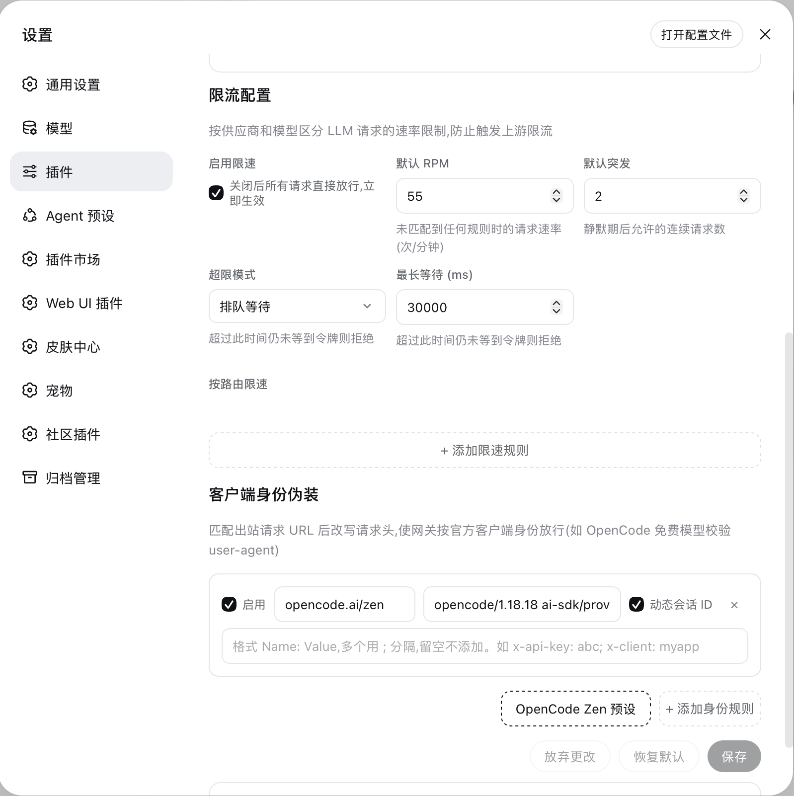
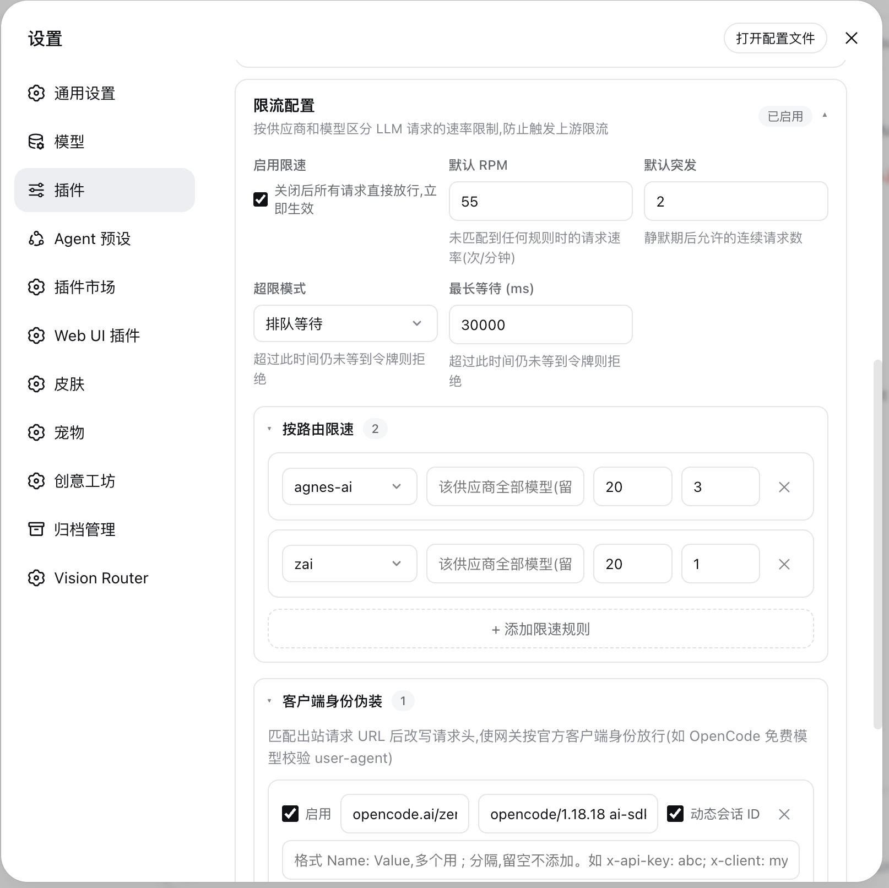
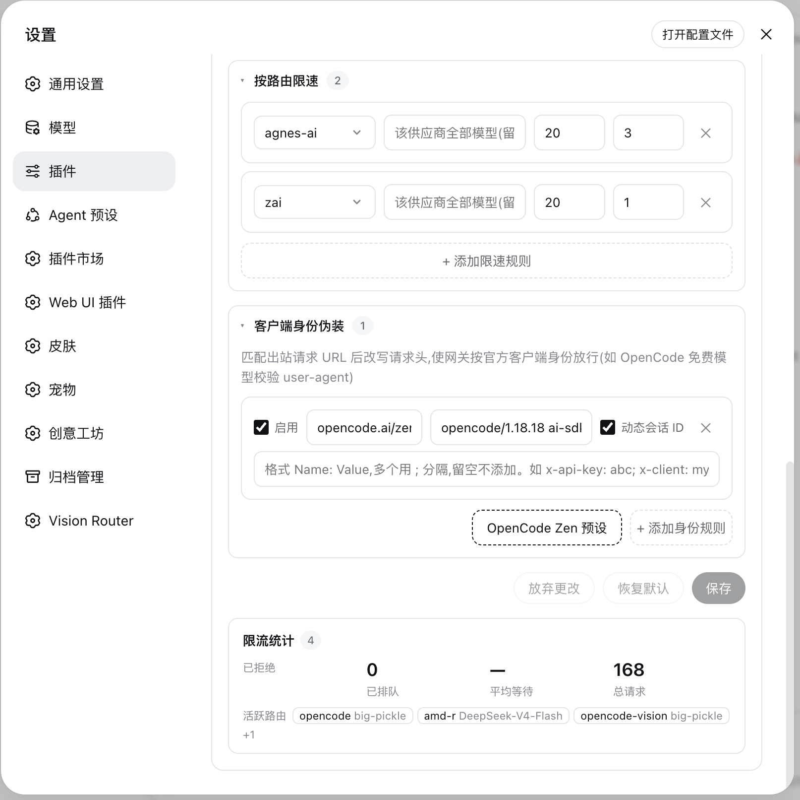

# dsh-provider-rate-limit

English | [简体中文](./README.zh-CN.md)

Per-provider **&** per-model rate limiting for [DeepSeek Harness](https://github.com/deepseek-ai/dsh) LLM traffic, plus gateway identity rules (client spoofing) for restricted free-tier gateways.

适用于 DeepSeek Harness 的按供应商/模型粒度 LLM 限速插件，附带网关身份规则（客户端伪装）能力。

## Features

- **Token-bucket rate limiting** per `(provider, model)` route — smooth refill with burst support, idle-time recovery
- **Two modes** when the bucket is empty:
  - `wait` — hold the request up to `maxWaitMs`, then let it through (transparent queueing)
  - `reject` — short-circuit immediately with a synthetic `RATE_LIMIT` response carrying `providerRetryAfterMs`
- **Strict FIFO** — reservation-based design guarantees same-order admission without polling
- **Gateway identity rules** — rewrite `User-Agent` / inject static headers for URLs matching a pattern (e.g. gateways that validate client identity), with a one-click **OpenCode Zen** preset
- **Master switch** — flip `enabled` off to pass all traffic instantly, no listener re-registration
- **Settings UI card** — full configuration from the Harness settings page, zh/en localized
- **Live stats line** — compact readout in the composer dock (under the chat input), auto-refreshes every 5s; hover to see per-route provider·model breakdown
- **Stats HTTP API** — `GET /api/provider-rate-limit.stats` returns aggregate and per-route counters as JSON (used by the dock line; also available for external tooling)
- **Cross-plugin stats service** — `provider-rate-limit/stats` service for in-process consumers (getStats, getAllStats, getAggregateStats, resetStats)
- **O(1) route lookup** — pre-built Map for rule matching instead of linear scan
- **Standard ULID** — 26-char Crockford base-32 IDs (48-bit big-endian time + 80-bit random)

## Install

### DSH plugin manager (recommended)

```bash
dsh plugin --profile web add github:jyao-SUSE-power-group/dsh-provider-rate-limit
```

Then restart DeepSeek Harness. The plugin registers itself into the `llm` service via its cordis patch.

### Manual

```bash
git clone https://github.com/jyao-SUSE-power-group/dsh-provider-rate-limit.git ~/.dsh/plugins/dsh-provider-rate-limit
cd ~/.dsh/plugins/dsh-provider-rate-limit && pnpm install --prod
```

## Configuration

Open **Settings → 插件 → Provider Rate Limit**. All options hot-reload — no restart needed.

| Option | Default | Description |
|---|---|---|
| `enabled` | `true` | Master switch; `false` passes everything untouched |
| `requestsPerMinute` | `20` | Global steady-state rate (applies when no route rule matches) |
| `burst` | `4` | Bucket capacity — how many requests may fire back-to-back |
| `mode` | `wait` | `wait` = queue up to `maxWaitMs`; `reject` = fail fast |
| `maxWaitMs` | `30000` | Longest queue time in `wait` mode before falling back to `reject` behavior |
| `models` | `[]` | Per-route overrides: match by provider/model substring, each with its own RPM/burst |

### Route rules

Route rules match on substrings of the resolved provider id and model name, e.g. provider `opencode` + model `claude-*`. The most specific matching rule wins; unmatched traffic uses the global limits.

### Identity rules

Some free-tier gateways (e.g. OpenCode Zen) reject clients whose requests don't look like their official tooling. Identity rules let selected outbound URLs carry a different identity:

- `urlPattern` — substring match against the request URL
- `userAgent` — replacement `User-Agent`
- `dynamicIds` — adds the per-request `x-opencode-client/project/session/request` header set
- `headers` — arbitrary static headers (`Name: Value` pairs), applied last so they can override everything above

The fetch patch is ref-counted and unwinds cleanly: when the plugin deactivates, native `fetch` is restored exactly once, and a patch layered above ours in the meantime is never clobbered.

> ⚠️ Only spoof identities for services you are legitimately entitled to use, and in accordance with their terms.

## How it works

Every outbound LLM stream passes through one `llm/stream` hook (a waterfall choke point covering agent loops, title generation, and compaction). Each call synchronously *reserves* a slot in the route's token bucket:

```
waitMs = bucket.reserve()        // exact wait, computed from a monotonic floor
if waitMs === 0                  → pass through immediately
else if mode=wait && ≤ maxWaitMs → sleep(waitMs), then pass
else                             → yield RATE_LIMIT finish (+ Retry-After hint)
```

The bucket floor is `now − (capacity − 1) × interval`, which gives classic burst-and-recover semantics: after idle time the bucket is implicitly full again, and resizing capacity/rate at runtime never mints a free burst.

## Live Stats

The plugin renders a compact stats line in the **composer dock** (below the chat input):

```
限流统计 已拒绝 0 · 已排队 0 · 平均等待 — · 总请求 153 · 活跃路由 3
```

Hover over the line to see a per-route breakdown (provider·model + request count). The data refreshes every 5 seconds.

### HTTP Endpoint

```
GET /api/provider-rate-limit.stats
```

Returns:

```json
{
  "ok": true,
  "value": {
    "aggregate": { "reserved": 153, "waited": 0, "totalWaitMs": 0, "rejected": 0, "avgWaitMs": 0, "routes": 3 },
    "routes": {
      "opencode\u0000big-pickle": { "reserved": 117, "waited": 0, ... },
      "opencode-vision\u0000big-pickle": { "reserved": 34, ... },
      "amd-r\u0000DeepSeek-V4-Flash": { "reserved": 2, ... }
    }
  }
}
```

## Cross-Plugin Stats API

Other plugins can query rate-limit statistics:

```js
// In a plugin's apply(ctx):
const stats = ctx.get("provider-rate-limit/stats");

// Per-route stats
const routeStats = stats.getStats("opencode", "deepseek-v4-flash-free");
// → { reserved, waited, totalWaitMs, rejected, avgWaitMs, peekWaitMs }

// All routes
const all = stats.getAllStats();
// → { "opencode\u0000deepseek-v4-flash-free": {...}, ... }

// Aggregate across all routes
const agg = stats.getAggregateStats();
// → { reserved, waited, totalWaitMs, rejected, avgWaitMs, routes }

// Reset counters (for per-window accounting)
stats.resetStats();              // all routes
stats.resetStats("opencode", "v3"); // specific route
```

## Development

```bash
pnpm install
npm test   # 19 tests: bucket behavior, FIFO, abort/reject, identity patch,
           # dispose, master switch, ULID format, stats service, multi-provider,
           # maxWaitMs timeout, hot-update retune, error handling
```

## Screenshots

### Settings Card



### Settings Configuration

| | |
|---|---|
|  |  |

### Composer Dock Live Stats


## License

[MIT](./LICENSE)
